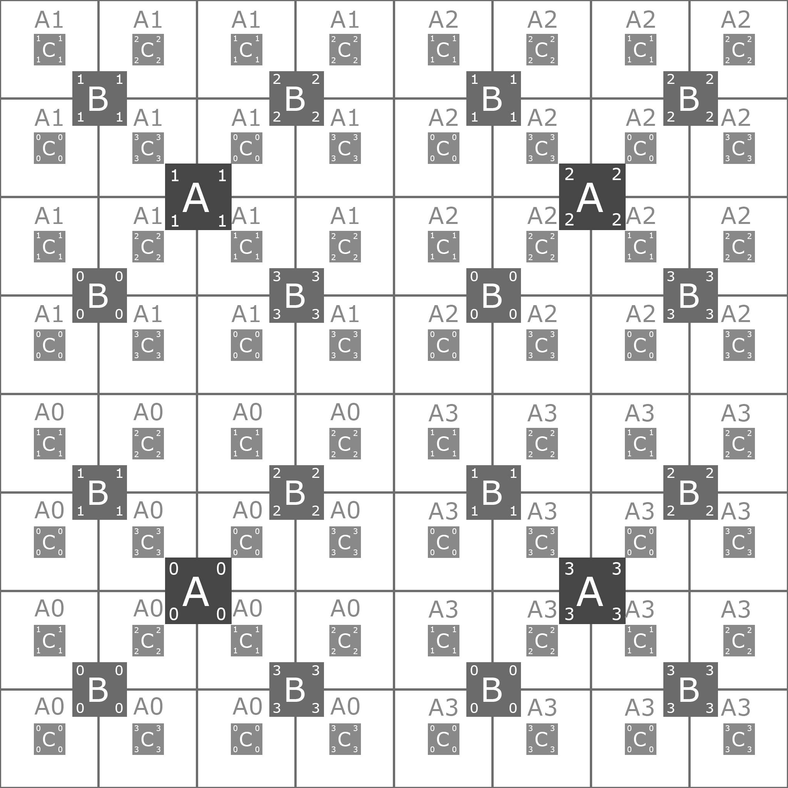
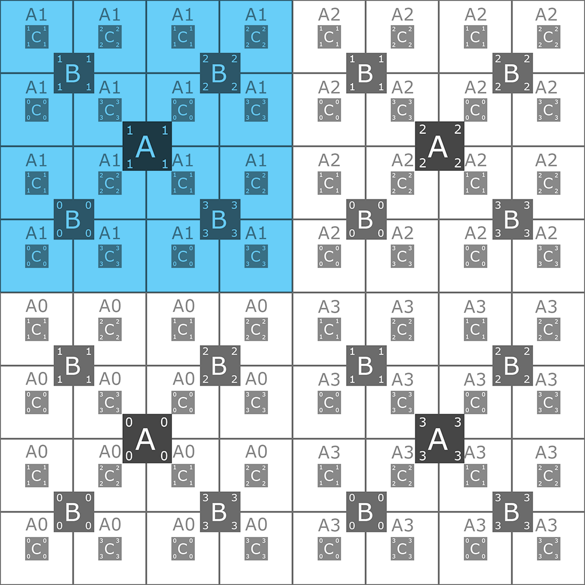
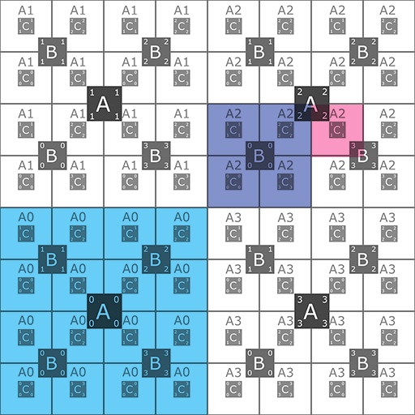

## jumper.uv
### Функция динамичного управления uv-развёртки

> Для работы требуется: ThreeJS и OBJLoader


### Пример использования с OBJLoader

```
var taskJump ={
    Name_models: ['A3', 'A2'],
    Name_models_2: ['A1']
}

var texture = new THREE.TextureLoader().load( "texture.jpg" );
texture.wrapS = THREE.RepeatWrapping;
texture.wrapT = THREE.RepeatWrapping;

var loader = new THREE.OBJLoader(); 

loader.load(
'Name_models.obj',
function ( object ) {
    object.children.forEach(function(e) {                        
        e.material = new THREE.MeshBasicMaterial( { color: 0xffffff, map: texture });
        for (var obj in taskJump){
            if (obj === e.name){
                e.geometry.attributes.uv = Jumper( e.geometry.attributes.uv, taskJump[obj][0] );
            }
        }
    });

    object.scale.set(2.5, 2.5, 2.5);
    group.add( object);
    scene.add( group );

});

```


### Принцип работы

> Задание с адресом участка передаётся обработчику. Обработчик берёт данные задания и uv-развёртки конкретной модели и делает вычисления размера и позиции развёртки.

;
> Создана система разметки участков

;
> UV-развётка модели меняет свою позицию согласно заданию

;
> Одновременно с одной текстурой может работать несколько моделей